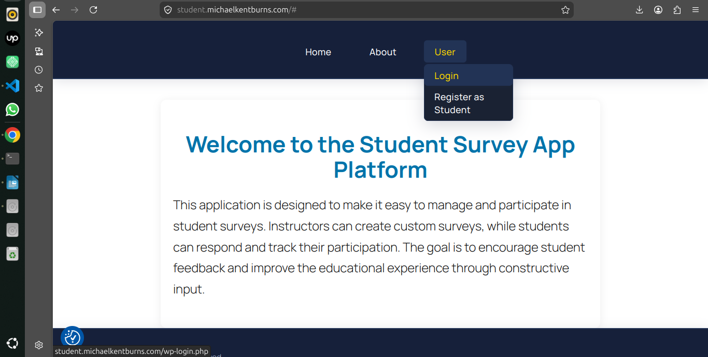
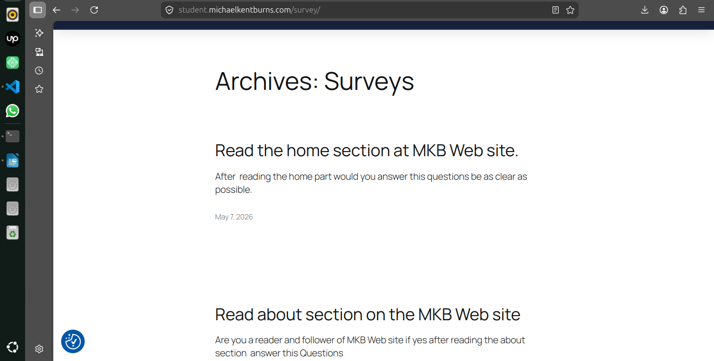
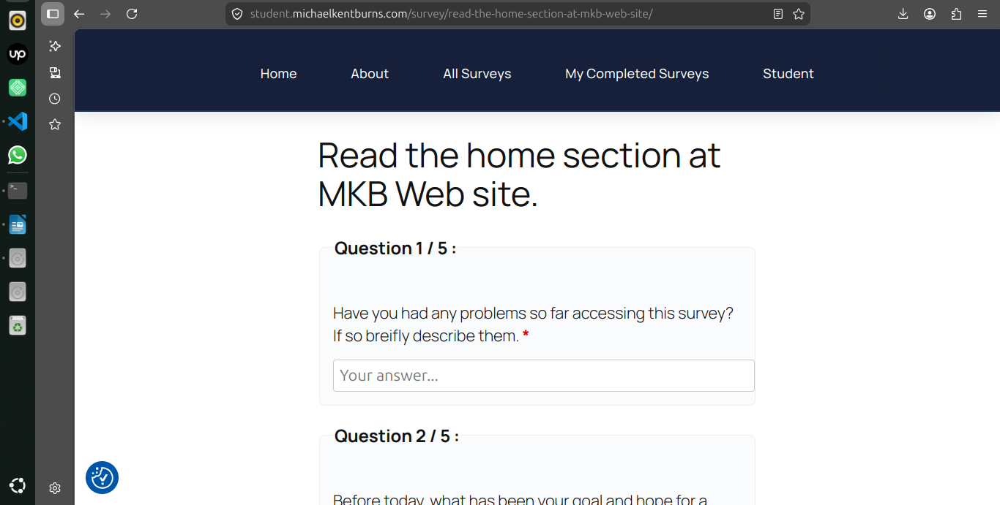
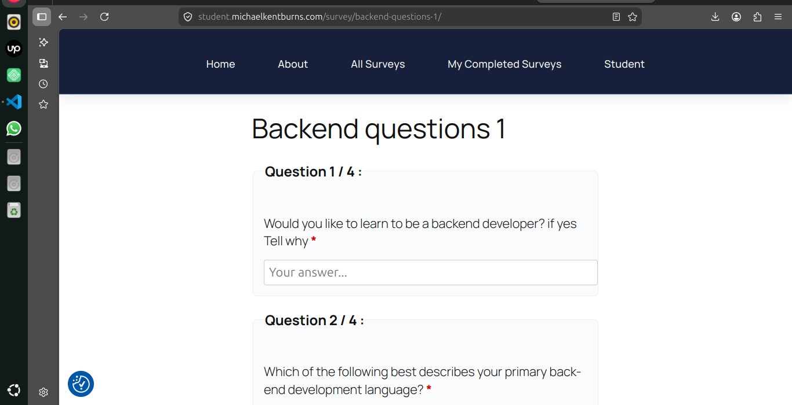
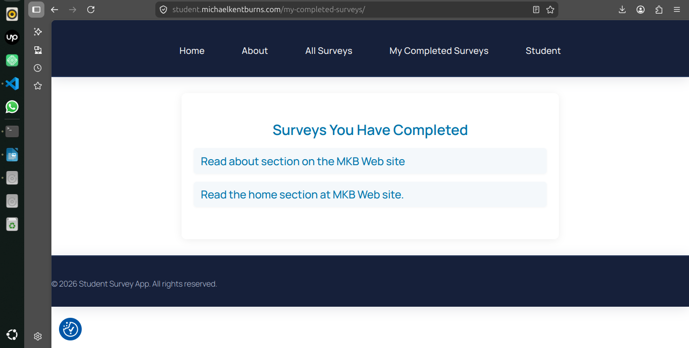

# TEST NOTES (Live Testing)

To access a page where the student dashboard is displayed, the user must first log in with credentials stored in the database. Once authenticated, the user is redirected to their personalized dashboard.

## What I am testing

The redirection to the student dashboard, completing the survey questions, and submitting them. The login logic works correctly according to the defined use case

# Login Dashboard for student user

Once the student enters valid credentials, the system authenticates the user against the database. Upon successful authentication, the system grants access and displays the personalized dashboard. This dashboard contains the list of available surveys assigned to the student, ensuring that the user is redirected to the correct interface corresponding to their role.

## What I am testing

   ### Authentication 
    
     The system verifies both the existence of the username and the validity of the password.

   ### Access Control 
     Only authenticated users are redirected to their dashboard.

   ### Personalization 
    
     The dashboard displayed is tailored to the student, showing only surveys relevant to them.

   ### Reliability
    
     This confirms that the login and redirection logic works correctly according to the defined use case.

 # Access the list of available surveys

## Step Description  
The student has the privilege to access the list of available surveys displayed on their dashboard. From this list, the student can review the options and select one survey to complete.

   ### Visibility 
    
     The system ensures that only surveys assigned to the student are displayed.

###   Accessibility 
 The student can freely navigate the list and choose the survey that best applies to them.

   ### Validation
     This step confirms that the use case is properly implemented, as the student is able to view and select a survey without restriction.

  ###  Compliance 
     The process aligns with the defined use case logic, ensuring consistency and reliability.     

     

# Survey Display and Instruction Compliance 

Once the student selects a survey, the system loads and displays the chosen survey in full detail. This includes the survey instructions, guidelines for completion, and the list of questions. The student can follow the provided instructions and respond to each question accordingly.

##  What I am testing

  ### Survey Presentation 
     The system ensures that the selected survey is displayed clearly, with all instructions visible before answering.

  ### Guidance
      Instructions are provided to help the student understand how to complete the survey (e.g., multiple-choice, rating scales, open-ended responses).

  ### Interaction
      The student can proceed to answer each question, following the logical flow of the survey.

   ### Validation
    
    This step confirms that the use case is properly implemented, as the survey display and interaction reflect exactly what was requested in the requirements.

   

# Feedback 

The student proceeds to answer the survey questions while navigating through the form. The system continuously records each response and verifies that all mandatory fields are completed. If required fields are left empty, the system highlights them and prompts the student to provide an answer. Once validation is successful, the system confirms the submission and may display a success message to acknowledge that the survey has been completed.

## What I am testing

  ### Response Entry 
  
  The student can move between questions and provide answers in different formats (multiple-choice, rating scales, open-ended).

### Validation

 The system checks for empty mandatory fields before allowing submission.

### Feedback 

 Clear prompts guide the student to complete missing information.

  
### Confirmation

 A success message reassures the student that their responses have been securely submitted

  

# Automatic Progress Saving and Navigation

 
The system records each response as it is entered, allows smooth navigation between questions, and automatically saves the student’s progress in case of disconnection or unexpected exit. This ensures that no data is lost and the student can resume the survey later without interruption. The use case is fully respected, reflecting the intended requirements and providing reliability in the survey process.

