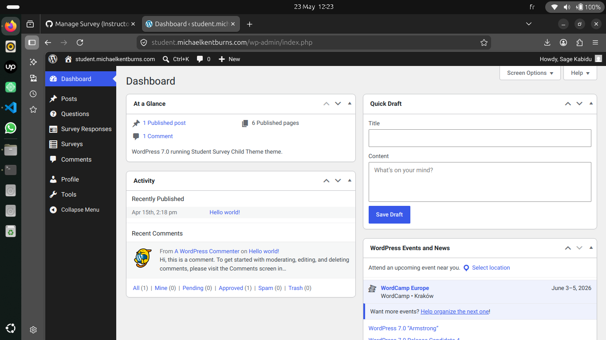
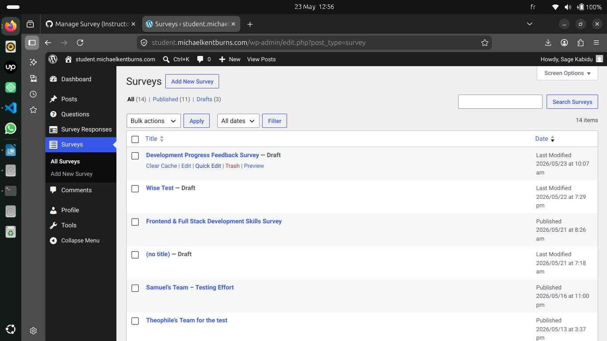
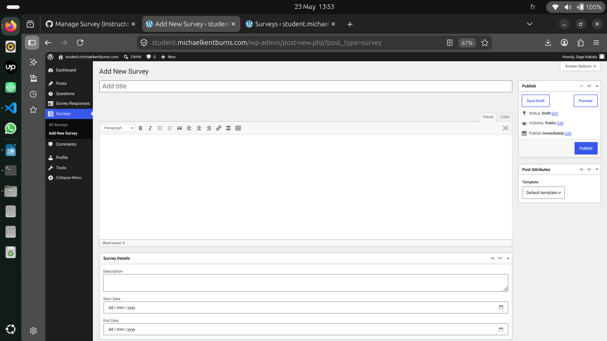
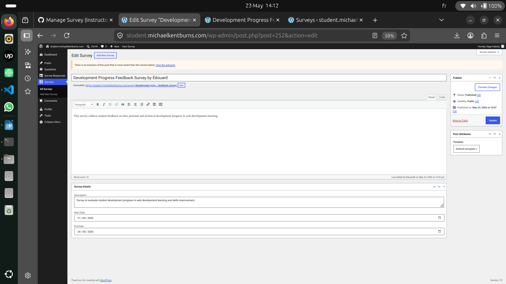
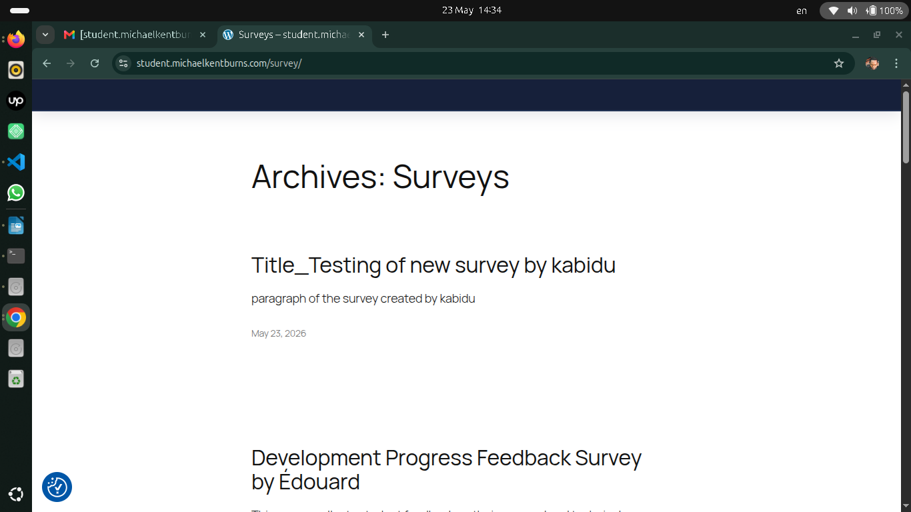
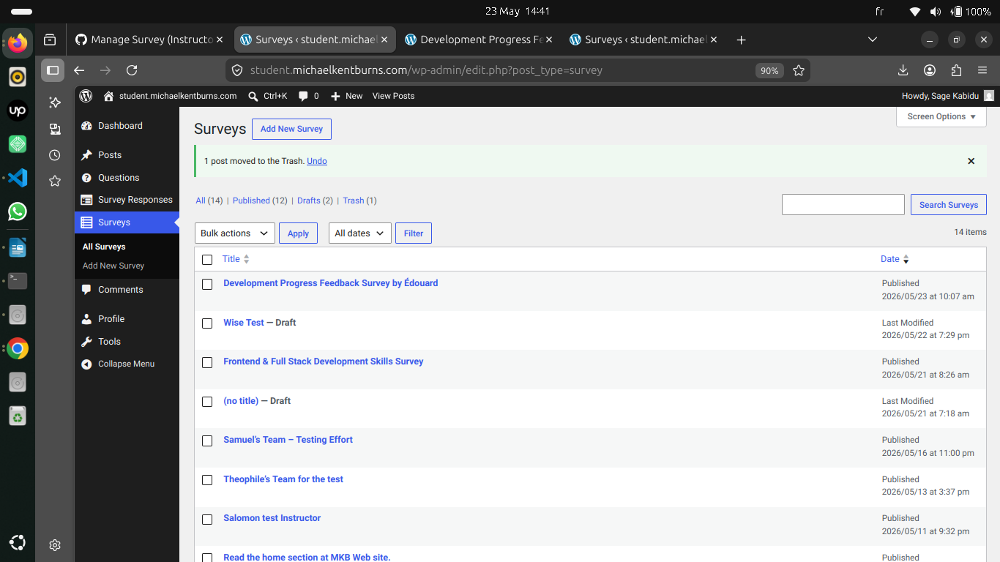

# My Dashboard

    Upon logging into the platform, I observed that my dashboard had switched to the instructor’s display, a view that was not previously available to me.      

# Surveys Dashboard 

   By accessing the Surveys section, I can view the list of existing surveys. For each survey, three management options are available (Create, Read, Update, Delete). A dedicated button also allows me to add a new survey.

### What I noticed 

At this stage, the use case is properly applied and accurately reflects the specified requirements.

# Form Surveys

By clicking on the Add New Survey button, I was redirected to a survey creation form. This form allowed me to define a title, a subtitle, a description, as well as an opening date and a closing date.

In this aspect, the use case is fully respected and faithfully reflects the stated requirements.

# Edite one of the surveys

    By selecting a survey, I have the option to edit it, delete it, or modify its dates, whether for opening or closing. These features are clearly visible and easily accessible.

### What I noticed 

    This confirms that the use case is fully respected and precisely meets the stated requirements.

# Deleting a survey 

I logged in with another account to verify the survey creation, since this account did not have permission to access the previously created survey.

Upon confirmation, the Surveys tab clearly showed that the survey had been added by the other account.

I then deleted the survey that I had created earlier.

This demonstrates that the use case is indeed respected and faithfully meets the stated requirements.

confirm that the input fields and error handling are properly respected when adding or modifying a survey.

The use case is indeed correctly applied and faithfully meets the specified requirements.
