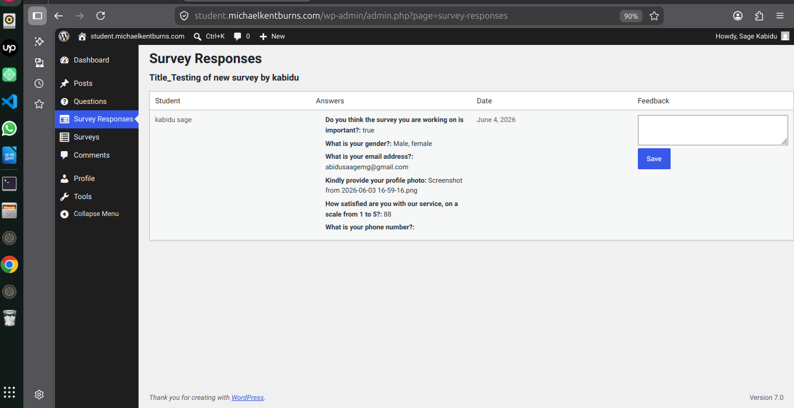

# Observation on Use Case Consistency  

    The instructor is correctly logged into the platform, and students have the ability to select or complete the questions posed. However, it is not possible for the instructor to perform any analysis of the survey responses.

    Therefore, the original use case objective is not respected, as it does not reflect the actual requirement: the system should emphasize student participation while restricting instructor analysis.
    

#  Postconditions Postconditions

    Non-Compliance with Use Case Objective  
    The expected postcondition stating that “aggregated statistics and charts are generated and displayed” is not fulfilled. Although the instructor is successfully logged into the platform and students are able to select or complete survey questions, the system does not provide the promised analytical output. No aggregated metrics or visualizations are generated, which means the core objective of enabling actionable insights through survey analysis is not respected. This gap highlights a misalignment between the defined use case and the actual system behavior.

# Conclusion

Ultimately, the discrepancy between the original use case objective and the actual system behavior highlights a significant inconsistency. While instructor login and student participation are properly supported, the lack of analytical tools and visual outputs undermines the core purpose of the process: generating actionable statistics and meaningful charts. This non‑compliance emphasizes the need for functional adjustments to ensure that the system fully meets its intended objective of encouraging student engagement while delivering reliable analytical insights.