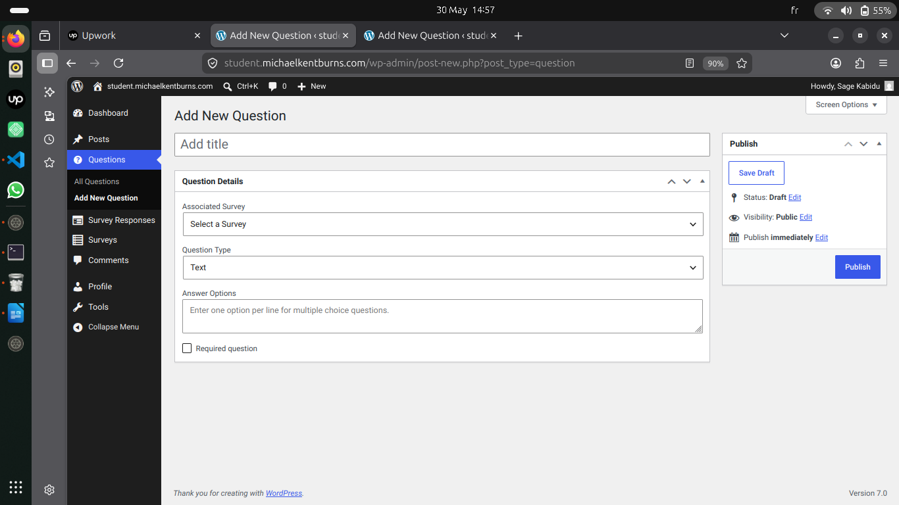
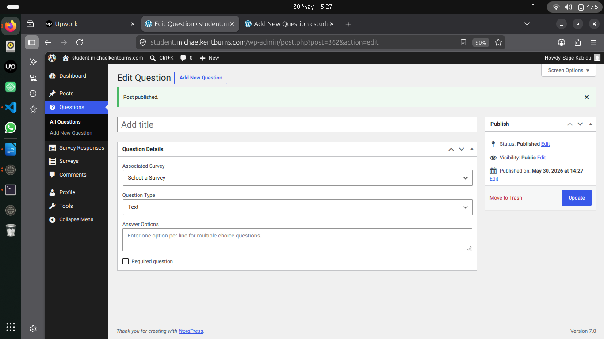
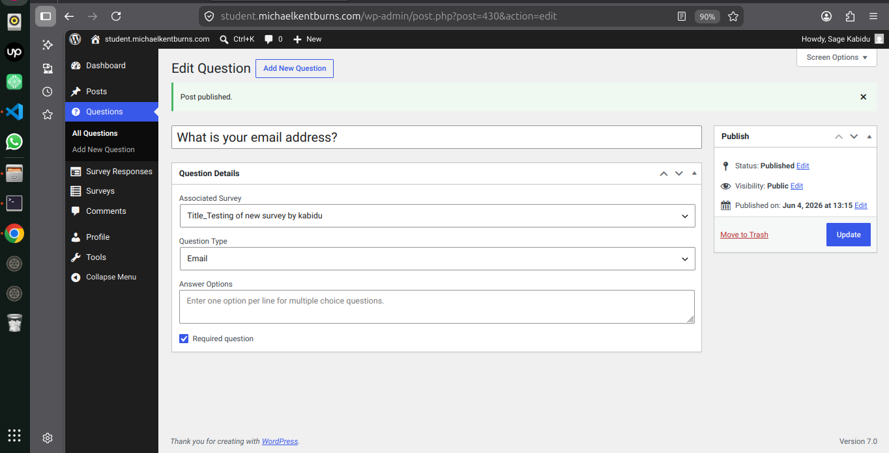
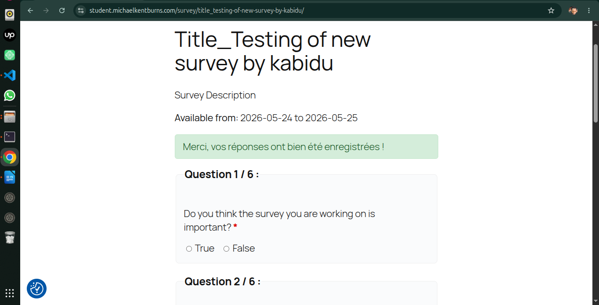
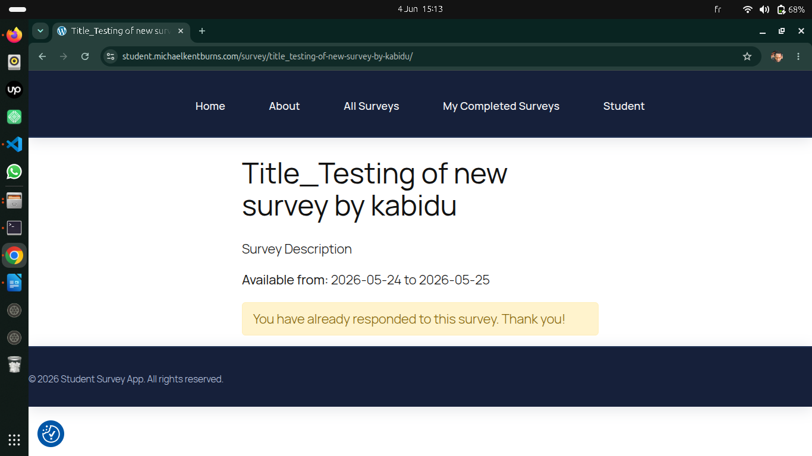

# Dashboard access and survey question addition

        By accessing the dashboard, I was able to see the button that allows adding a question to the survey. Once clicked, the form appeared to draft the survey question.

      .

        This confirms that the use case is properly respected
# Confirmation of Proper Selection Process

        The system properly presents the question type selection: a clear and complete list is displayed, including Multiple Choice, True/False, Short Answer, and Essay.
        This confirms that the use case is fully respected. The Instructor enjoys a smooth and intuitive experience, with an interface that meets expectations and makes survey creation straightforward

## What I noticed

        Before completing a question, the Instructor must select the survey to which the question will be assigned. However, when clicking the “Update” button, the form does not validate the empty fields: the question is published (saved) directly without any prior check.
        This highlights a gap in the data validation process, as the system should prevent saving until all mandatory fields are completed.

   

# Question Type

                I tested all types of questions and they all worked, which confirms that the question types are respected and accurately reflect the requirement.

## What I noticed

                However, I noticed that once the Instructor starts adding a new question, they must exit the section where the question is defined. For example, they may click on the Dashboard tab and then return to the section for adding a survey question.
                If this step is not followed, the system interprets the action as editing the previous question.

 

# Required Question

                When a student skips a question that is not marked as required, the system still validates the form and submits it to the Instructor.
                This confirms that the form logic is properly respected: only mandatory questions must be completed in order to allow submission.

# student answer

                The questions are properly displayed on the student’s interface, and they can answer them freely. The system’s role is only to perform the necessary validation. However, once the form has been submitted, the student can no longer go back to edit any missing information or provide a clear and important answer they may have remembered afterward.

# Conclusion

Overall, the system properly respects the intended use cases: questions are displayed correctly, all question types work as expected, and the form logic is consistent. Some improvements are still needed, particularly in mandatory field validation and handling backward navigation after submission. Nevertheless, the experience remains smooth and intuitive, providing both Instructor and Student with a clear and straightforward workflow.