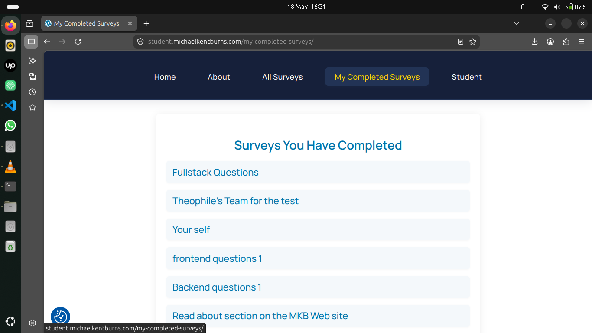
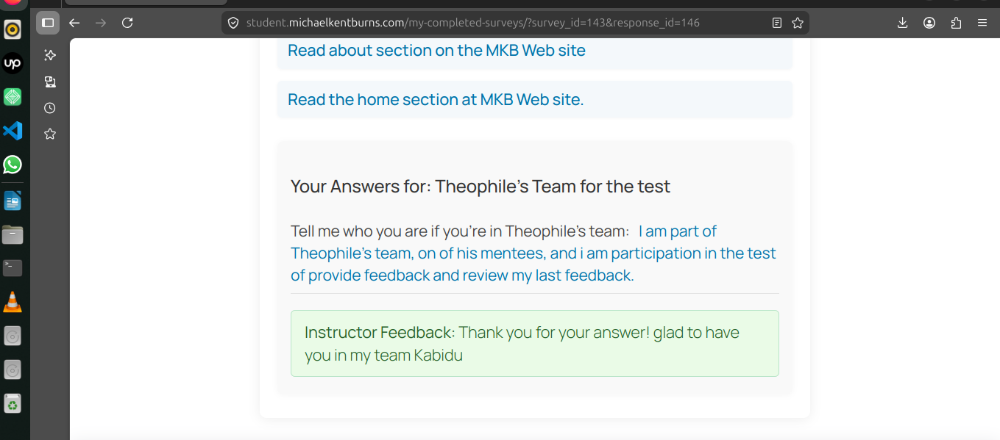

## What I am testing

# Review Past Feedback

The accessibility of my dashboaard allowed me to view all my previously completed surveys

# Feedback from my instructor

    I was able to view the question defined by the instuctor along with my corresponing answer.

    However, the details regarding the date and the data sorting were not displayed or managed as the use case had originally specified this lack of compliance reduces both the traceability and the consistency of the expected outcomes within the defined scenario. 

