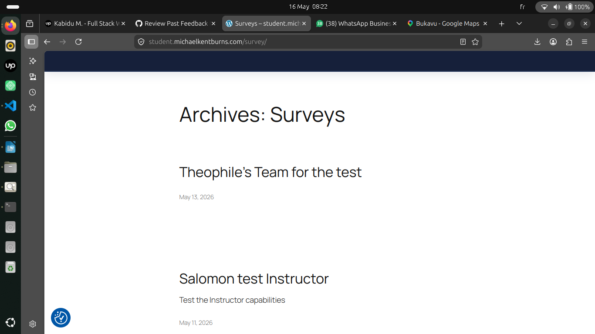
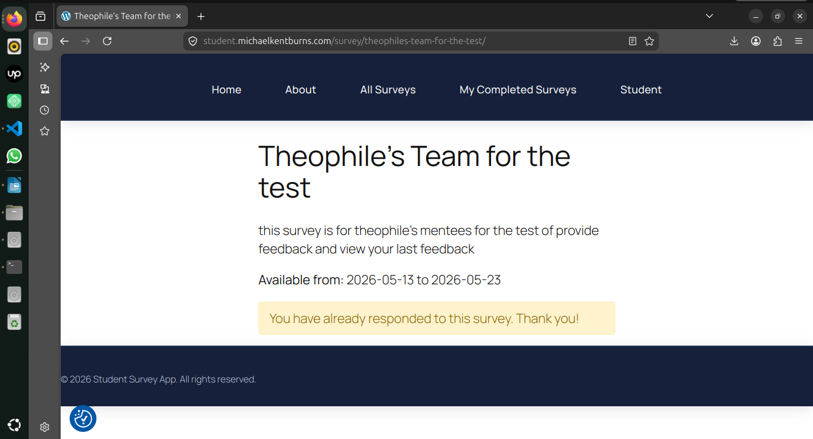

## What I am testing

# Review Past Feedback

    To access the dashboard, the user must log in with their credentials; otherwise, they will not be able to view the feedback.

## What I did 

    1. I opened the application.

    2. I logged in with my credentials.

    3. I accessed the dashboard.

## What I noticed (IMPORTANT)

I can say that the use case is fully respected and accurately reflects the requested need.

## Student Dashboard

### What I did 

    1. I found a survey question available.

    1. I wrote my response and submitted it.

    Upon accessing the dashboard, I immediately found a survey question available, which is a positive aspect and fully aligned with the use case.

# Ensuring proper feedback 

    I wrote my response and submitted it; upon sending, I received a confirmation message indicating that my response had been successfully submitted.

# Feedback from my instructor

    I received feedback from my instructor as a response to the survey I had completed a little later, and in this case the use case was properly respected.

    I then returned once again to the section that allows me to review my surveys. I clicked on the same survey, and I was able to see the date on which I had submitted it, along with a message that said: “You have already responded to this survey. Thank you.”

    All of this perfectly respects the use case.

### What  happened   

1. After some time, I received feedback from my instructor regarding the survey.

2. I returned to the “My Surveys” section, clicked on the same survey, and saw the submission date along with a message

In conclusion, we can say that the entire use case for the student is well respected and fully meets the requested need in a professional manner.