# What I am testing

## register as a student 
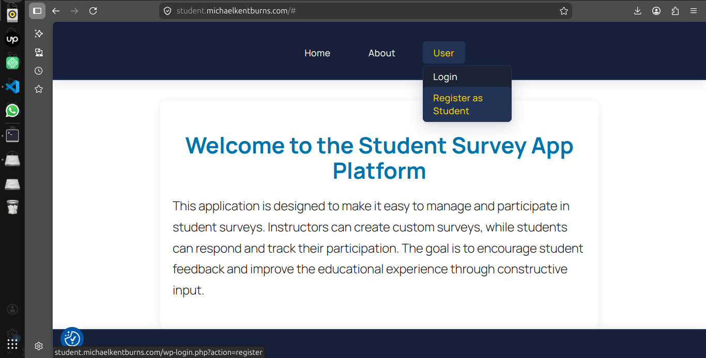
first launch of the website, i selected the type of account i wanted to create.
In my case, it was student account

--- 
# Register form
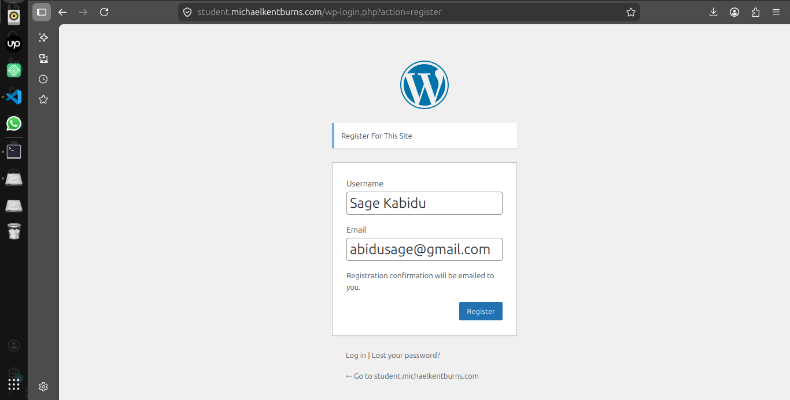
After opening the application, I navigate to the "User" tab.
then, I select the option "Register as Student".
Finally, I confirm my registration by clicking the "Register" button.

### What I noticed (IMPORTANT)

What I found important here is the flexibility given to the user during registration.
The user can register with either a single name or two names, with the option to include a space between them or not.
The application correctly recognizes this logic and handles the space consistently.

---
# Login Details
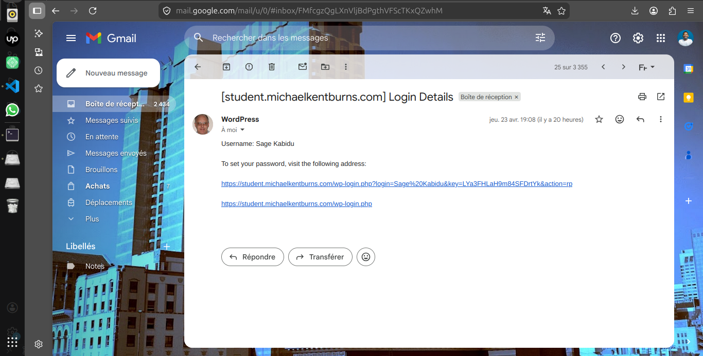
After completing the registration process, a message appeared instructing me to check my email inbox.
I opened my mailbox and found a link allowing me to change my password.

### What should have happened

I noticed that the account confirmation was processed automatically.

however, according to the intended use case, the confirmation should be handled manually by the administrator

This action should be carried out with human intervention, that is, validated manually by the administrator.

---
# error message to reset password
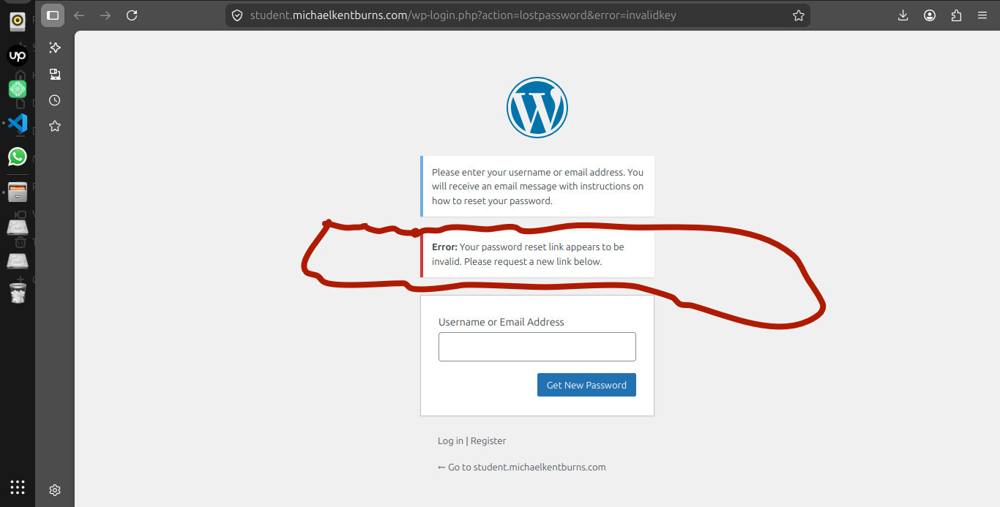
Since the assigned password was unusual and difficult to remember, I decided to change it.
To do so, i clicked on the link received in my email inbox, which redirected to a form.
In this form, I was asked to enter my email address.

I opened the password reset page, the Input field was still empty,
however, an error message was already displayed before any action was taken.
normally, this error should only appear after clicking The "Get New Password" button when the field is left empty

### What should have happened
The error message should only appear after the user clicks the “Get New Password” button when the field is left empty.
It should not be displayed automatically upon opening the page, to avoid confusion and ensure a better user experience

----

## testing the application's logic.
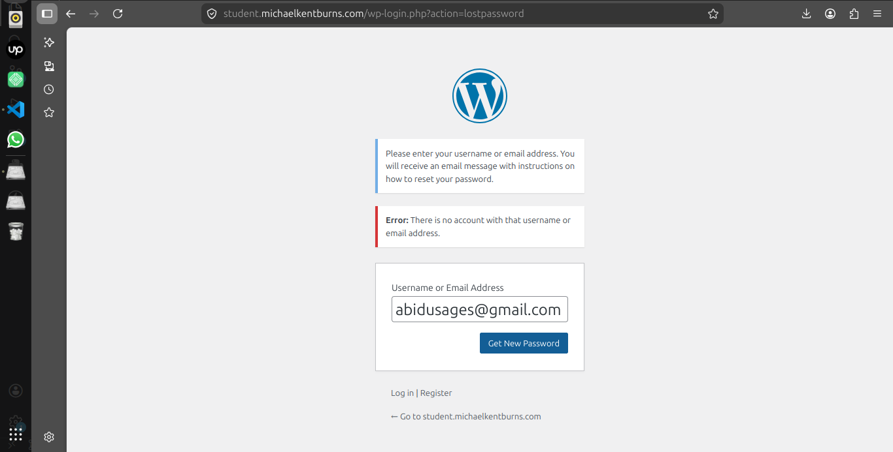
I did not stop there, as I wanted to test the application's logic.
I entered an email address similar to the one used during my registration, but not the exact registered address.
### What should have 
At the point, the screen flickered, and the message displayed was unclear.
For a better user experience

### What should have happened
I would have preferred to see a clear message written in red, to immediately catch the user's attention and curiosity.

### Get New password
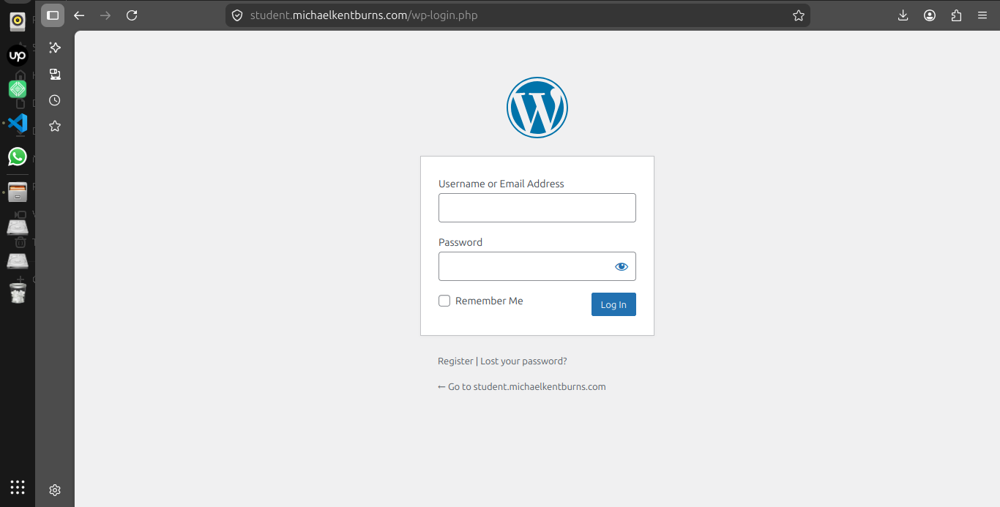
when i clicked on the "Get New password" button, it took about 10.17 seconds to receive the password reset message.
The process was very fast and automatic.
The password was successfully changed, and I was then redirected to the login page.

## Student Dashboard
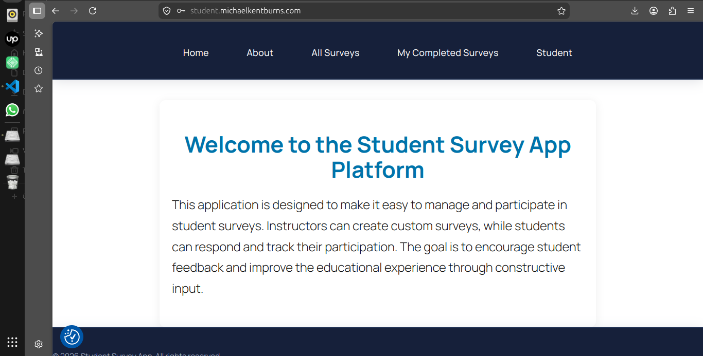
After setting my new password, I logged in using my email address and the defined password.
The authentication was successful, and i was redirected to the student account dashboard.

## Login with username or email address

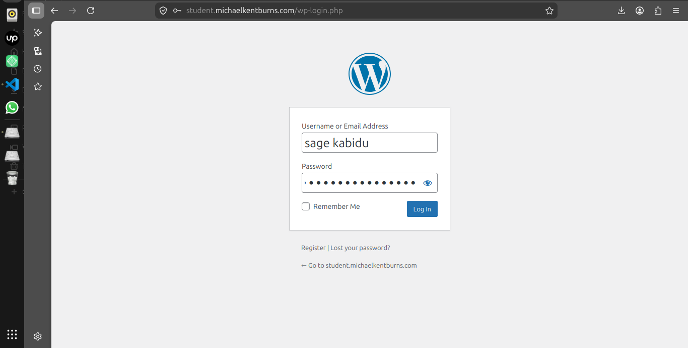

according to the application's logic, the user should be able to log in either with an email address or a username.
i tested this feature to ensure it was working properly.
in both cases, i was redirected to the same student account dashboard.
this confirms that logging in with either email or username works correctly.

## Username with more space 

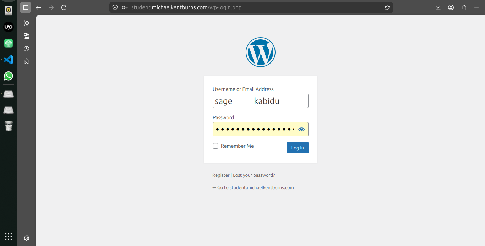
While testing the "Username" field further, i noticed that if during registration, the user enters two names separated by a space, the application does not take into account how many times the space key is pressed.

However, it is mandatory to include the space if it was used during registration.

For example, even if the space key is pressed multiple times (5 or 6 times), the system still interprets it as a single space.

## Login with  an incorrect password.

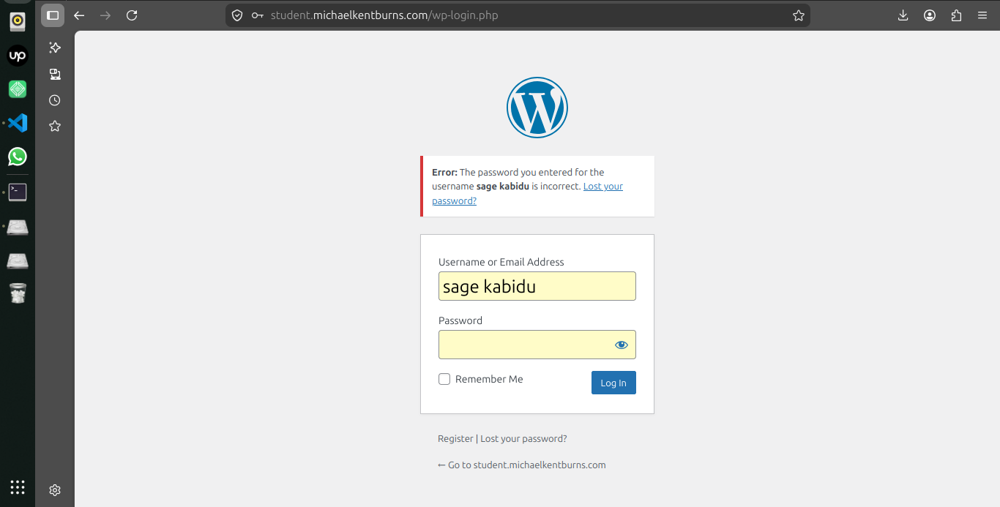
I also tested logging in with an incorrect password.
I noticed that whether using the email address or the username, if the password is not found in the database, the user cannot access the dashboard.

This confirms that the security logic works properly.
However, I observed that the error messages are not clearly highlighted(for example, no distinctive color or specific field), which may negatively affect the user experience.

## Functionality missing from the user case diagrame

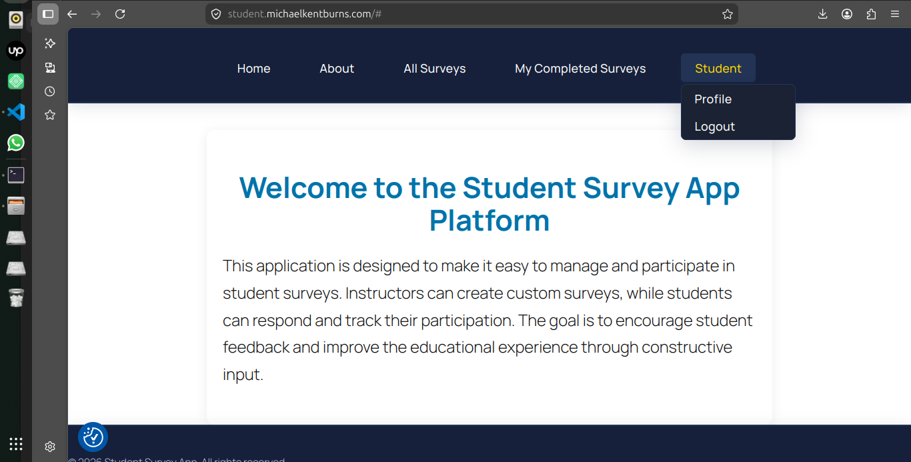
On the user profile, the user should normally have access to their personal information in order to update it. This functionality is missing from the use case diagram, which represents a gap in the intended design.

### All surveys Tab
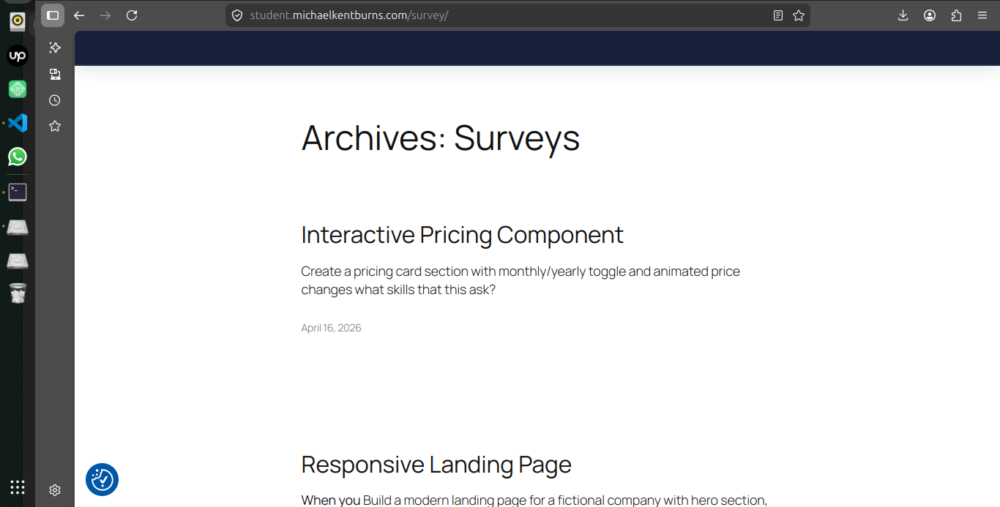

In the navigation bar, specifically on the All Surveys tab, once the user clicks on it, the display should be consistent with the other tabs to ensure a uniform experience and provide full freedom of navigation.

### Design
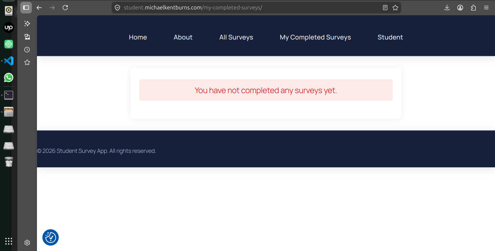

The overall design is good, and the colors are well chosen.
However, one aspect needs improvement in the navbar: when clicking on “My Completed Surveys”, the footer is displayed aligned in the middle of the screen on desktop, which disrupts the layout.