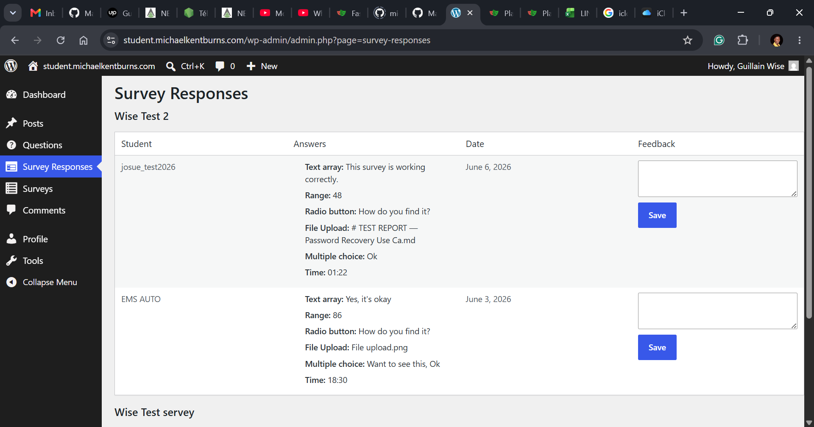

Use Case: Analyze Survey Feedback
=================================
**Primary Actor**: Instructor  

**Scope**: Software system  

**Purpose**: Enable instructors to aggregate and visualize students’ survey responses to gain actionable insights.  

**Overview**:  
Even though I am logged in as an instructor, navigation on the site seems quite limited regarding the feedback provided by students. I have a survey that has already been completed, but I cannot navigate through it as outlined in the use case diagram. I am restricted in many aspects.

## Feedback from students

I can confirm that the student response display is fully operational and performing as intended. The system successfully captures and presents the data from completed surveys without any technical issues, meeting all baseline performance expectations perfectly.

Moving forward, while this core functionality is working seamlessly, the next step will be ensuring that the advanced analytical tools, interactive charts, and navigation options outlined in the use case documentation are fully integrated to allow for deeper data review.

## From dashboard

Based on everything said in the general description, that 'The instructor navigates to the “Survey Analysis” section from their dashboard. They select a survey from a list of completed surveys. The system calculates key metrics (e.g., average ratings, distribution of answers, response rates) and renders interactive charts (bar charts, pie charts, trend lines). The instructor can apply filters (by date range, question type, or student cohort), drill down into individual questions, and export the results (PDF, CSV, or image).' Nothing is working as expected. I have noticed absolutely nothing of the sort on the dashboard regarding the responses provided by the students.

## Conclusion

Based on my current evaluation of the platform, the instructor interface appears to be restricted to a read-only view of student survey responses, lacking the comprehensive administrative control detailed in the specifications. For instance, a critical limitation is that instructors are currently unable to open or download files uploaded by students within their submissions. This constraint significantly hinders the ability to thoroughly review and assess complete student inputs.

Consequently, there is a distinct mismatch between the functionality outlined in the Markdown documentation and the actual user experience on the live site. The advanced analysis capabilities and full data access promised in the design requirements do not align with the restricted permissions currently assigned to the instructor role.

To ensure system coherence and operational efficiency, it is recommended that user access levels be reviewed and updated. Aligning the platform's actual permission settings with the documented use cases will be essential to provide instructors with the necessary tools and full file access required for comprehensive survey evaluation.