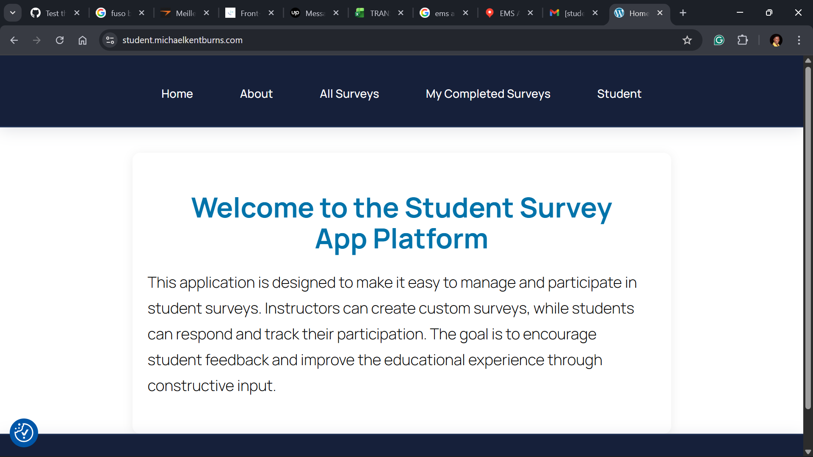

## What I am testing

### Register as a student

This screenshot serves as proof of my student registration. I'll start the registration process, and I'll address the remaining details in the work that follows.

### Mail confirmation

After completing my registration on the site as a student, I received this confirmation email in my inbox. According to the logic of the use-case diagram, everything is clear and precise up to this point.

### Changine my password

By confirming my email address, I was able to access the student dashboard on the site, and so far, everything is functioning as expected according to the student use-case diagram.

### Confirmation email of changing password

In the process of initiating a password change, the system obliges me to provide my email address as a means of verifying that the request genuinely originates from me.

### WEAK Password

When attempting to change my password to one of my own preference, the system refused to save it, claiming it was too weak. On this point, I believe that the choice of password should remain a personal decision. In particular, students often prefer something simple rather than overly complex, and such flexibility could help reduce the frequent reliance on the 'forgot password' option. 

### Strong Password

After adding characters and other symbols to the password, I was finally able to change it and move on to the next step. However, this requirement is personally difficult for me, and perhaps for some students as well, because forgetting even a single symbol would force us to repeatedly reset the password.

 ### DASHBOARD

After attempting to change the password, this step went smoothly, and in the end, I was able to access the student dashboard.
 

## What I did (steps)

After receiving the repository from my mentor, I proceeded to the site where I created a student account using my personal details. I entered an email address, and subsequently, a confirmation password was sent to me. At first, I used the default password before changing it to another one. This was unexpected on my part, as I initially believed that each user had the freedom to create a password of their own choice. However, I discovered that this was not possible, so I followed the system’s recommendation and successfully created a new password. Afterwards, I accessed the homepage and scrolled through the displayed menus, which allowed me to take the screenshot that I mentioned earlier in my report regarding the tabs."

Here is the clear sequence:

1. Receiving the repository.

2. Creating the account.

3. Email confirmation and default password.

4. Password change process.

5. Accessing the homepage.

## What I noticed (IMPORTANT)

Similar to the 'create account' diagram, it was mentioned that there is a section where one can set the level and change languages. Unfortunately, however, I could not find this in my process. Additionally, it appears that account creation does not wait for administrator validation; I noticed that it is an automatic process once the email confirmation is received the rest is almost entirely automated.

---

## What should have happened

According to the diagram, what should happen is that the student must wait for the administrator to approve their account, and they should also be able to choose their language.

---

## Is this a problem?

It’s not a problem at all, as it doesn't prevent the student from reaching the site's dashboard.

---

## Action taken

- Documented all navigation and layout issues and captured visual evidence for the development team.

---
